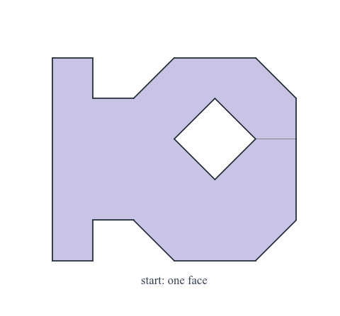

# par-quad

Code for **Playing to Par: Reinforcement Learning for Provably Optimal Quadrilateral Block Decompositions**.

<p align="center"></p>

An agent that builds quadrilateral block decompositions from a domain's bare boundary and
aims for **par**: the lower bound on vertex irregularity that the discrete Gauss–Bonnet
identity fixes from the domain's corner angles and topology alone. A mesh that reaches par
is provably optimal in its connectivity.

[Paper](https://arxiv.org/abs/2609.32146) · [Project page](https://arjunnarayanan.github.io/par-quad/) · [Play Mesh Quest](https://arjunnarayanan.github.io/par-quad/play.html) · [Model on Hugging Face](https://huggingface.co/arjunnarayanan/par-quad-pinwheel-mitq-e2e-v1-4M)

## Install

Python 3.11 or 3.12.

```bash
git clone https://github.com/ArjunNarayanan/par-quad.git
cd par-quad
python3.12 -m venv venv
# CPU-only machines: install the CPU build of torch first, which avoids a large CUDA download
venv/bin/pip install torch==2.7.1 --index-url https://download.pytorch.org/whl/cpu
venv/bin/pip install -r requirements.txt
```

The evaluation domains come from **geo2d**, a separate package that will be released shortly.
Until then a stand-in generator ships in `tools/geo2d_lite`. It runs everything below, but it
draws different domains from the paper's, so it does not reproduce the tables:

```bash
export GEOGEN_PATH=tools/geo2d_lite
```

Check the installation with `venv/bin/python -m pytest -q test`.

## Quickstart

Mesh one evaluation domain with the released agent and write an animation of it
(`out/demo.mp4`, `out/demo.gif`):

```bash
venv/bin/python utilities/animate_rollout.py -suite straight-holes -draw 10 -n 24 -out out -name demo
```

Score the agent on a suite under the paper's evaluation procedure (five attempts, doubled
move budget, split-and-continue repair):

```bash
venv/bin/python utilities/score_quality_objective.py \
    -config models/paper-2026-09-24/pinwheel-mitq-e2e-v1.config.yml \
    -checkpoint models/paper-2026-09-24/pinwheel-mitq-e2e-v1-4M.zip \
    -suites straight-holes -n 24 -seed 7 -rollout_seed 0 \
    -n_samples 4 -max_steps_factor 6 -repair_rounds 3 -repair_bar 0.3 \
    -out out/paper/released/straight-holes.0.json
```

## Reproducing the paper

The evaluation sets are four suites each: `straight`, `polycube`, `straight-holes` and
`polycube-holes` (24 domains each, 8–24 corners), and the same four with `-transfer` appended
(16 domains each, 25–50 corners). Domains are fixed by `-seed 7`; the tables average
rollout seeds 0–5 in distribution and 0–3 on the larger set.

1. **Score the agent** with the command above, once per suite and rollout seed, writing
   `out/paper/released/<suite>.<rollout_seed>.json`.
2. **Run Gmsh** on the same domains, matched to the agent's element count:
   ```bash
   venv/bin/python utilities/gmsh_variants_suite.py -suite straight-holes \
       -agent out/paper/released/straight-holes.0.json -out out/paper/gmsh/straight-holes.json
   ```
3. **Tables and win rates:**
   ```bash
   venv/bin/python utilities/paper_tables.py -tag released -gmsh out/paper/gmsh
   venv/bin/python utilities/head_to_head.py -tag released -gmsh out/paper/gmsh -criterion quality
   venv/bin/python utilities/head_to_head.py -tag released -gmsh out/paper/gmsh -criterion regularity
   ```
4. **Curved boundaries** (the released agent with the test-time repair search, then Gmsh
   scored on the arc tangents and on chords):
   ```bash
   utilities/run_surgery_suites.sh out/surgery
   ```
5. **Figures:** `utilities/paper_figure.py` (Figure 1 and the galleries),
   `utilities/paper_distributions.py`, `utilities/paper_certified_figure.py` and
   `utilities/surgery_gallery.py` (the curved gallery). The par > 0 study uses
   `utilities/subproblem_par.py` and `utilities/gmsh_par_set.py` with `data/par_test_set.pkl`.

Each script documents its options at the top of the file.

## Training

The released agent (`models/paper-2026-09-24/pinwheel-mitq-e2e-v1-4M.zip`) is behaviour
cloning on certified instances followed by four million PPO steps. The whole recipe takes
about four hours on a laptop.

```bash
# 1. certified instances and the cloned policy
#    (models/paper-2026-09-24/pinwheel-v1-seed1-clone.zip is its output)
utilities/run_arm.sh pinwheel 6 1

# 2. PPO from the clone, with certified instances mixed into the episodes
ANCHOR=mixture STEPS=4000000 \
PPO_FLAGS="-demo_generator -demo_hole_probability 0.30 -demo_pinwheel_probability 0.40 -demo_gate untangle" \
utilities/run_scale_arm.sh pinwheel-mitq-e2e-v1 models/paper-2026-09-24/pinwheel-v1-seed1-clone.zip 8
```

## Layout

| | |
|---|---|
| `src/tiler.py` | the half-edge mesh and its edit operations |
| `envs/` | the decomposition MDP (`global_angle_env.py`), the certified-instance generator (`solved_instances.py`) |
| `src/dcel_convolution.py`, `src/convolution_feature_extractor.py`, `src/policy.py` | the policy network |
| `src/behaviour_cloning.py`, `workflows/train_bc.py`, `workflows/train_warm_ppo.py` | training |
| `src/surgery.py`, `utilities/curved_surgery_eval.py` | the curved repair search |
| `utilities/` | evaluation, the Gmsh comparison, tables and figures |
| `game/` | Mesh Quest, the MDP as a browser game (`game/build.sh` builds `docs/play.html`) |
| `docs/` | the project page |

## Citation

```bibtex
@article{narayanan2026playing,
  title   = {Playing to Par: Reinforcement Learning for Provably Optimal
             Quadrilateral Block Decompositions},
  author  = {Narayanan, Arjun and Persson, Per-Olof},
  journal = {arXiv preprint arXiv:2609.32146},
  year    = {2026}
}
```

## License

MIT; see [LICENSE](LICENSE).
